### 0. Libraries


```r
library(tidyverse)
library(igraph)
library(sbm)
library(tibble)
library(janitor)
library(patchwork)
library(sand)
library(ggplot2)
library(gridExtra)


set.seed(20230605)
```

### 1. Import dataset

#### 1.1 Description of dataset

This is who-trusts-whom network of people who trade using **Bitcoin** on a platform called **Bitcoin OTC**.\
Since Bitcoin users are **anonymous**, there is a need to maintain a record of users' reputation to prevent transactions with fraudulent and risky users.\
Members of Bitcoin Alpha rate other members in a scale of -10 (total distrust) to +10 (total trust) in steps of 1.\
This is the **weighted signed directed network** and we took the dataset from [here](https://snap.stanford.edu/data/soc-sign-bitcoin-otc.html) 

#### 1.2 Description of features

-   **SOURCE**: node id of source (i.e rater)
-   **TARGET**: node id of target (i.e ratee)
-   **RATING**: the source's rating for the target, ranging from -10 to +10 in steps of 1
-   **TIME**: the time of the rating, measured as seconds since Epoch.


```r
file_path <- "~/Downloads/newlab/Bitcoin_Network/soc-sign-bitcoinotc.csv"
# Import the CSV file
data <- read.csv(file_path, header = FALSE)

# Define custom column names
column_names <- c("SOURCE", "TARGET", "RATING", "TIME")

# Assign column names to the data frame
colnames(data) <- column_names

# Transform the time and drop the variable Time that was in epoch
df <- data %>%
  mutate(time = as.POSIXct(TIME, origin = "1970-01-01")) %>% select(-TIME) %>% clean_names(case='snake')

glimpse(df)
```

```
## Rows: 35,592
## Columns: 4
## $ source <int> 6, 6, 1, 4, 13, 13, 7, 2, 2, 21, 21, 21, 21, 21, 17, 17, 10, 10…
## $ target <int> 2, 5, 15, 3, 16, 10, 5, 21, 20, 2, 1, 10, 8, 3, 3, 23, 1, 6, 21…
## $ rating <int> 4, 2, 1, 7, 8, 8, 1, 5, 5, 5, 8, 8, 9, 7, 5, 1, 8, 7, 8, 1, 10,…
## $ time   <dttm> 2010-11-08 19:45:11, 2010-11-08 19:45:41, 2010-11-08 20:05:40,…
```

```r
summary(df)
```

```
##      source         target         rating       
##  Min.   :   1   Min.   :   1   Min.   :-10.000  
##  1st Qu.: 988   1st Qu.: 978   1st Qu.:  1.000  
##  Median :2125   Median :2178   Median :  1.000  
##  Mean   :2354   Mean   :2417   Mean   :  1.012  
##  3rd Qu.:3722   3rd Qu.:3804   3rd Qu.:  2.000  
##  Max.   :6000   Max.   :6005   Max.   : 10.000  
##       time                       
##  Min.   :2010-11-08 19:45:11.73  
##  1st Qu.:2012-03-08 22:47:10.07  
##  Median :2013-01-17 02:06:14.49  
##  Mean   :2012-12-17 03:23:47.47  
##  3rd Qu.:2013-08-15 22:29:16.83  
##  Max.   :2016-01-25 02:12:03.75
```

```r
# Transform it to the graph
g<- graph_from_data_frame(df,directed=TRUE)
```

### 2. Exploratory Data Analysis


```r
# Get the number of nodes and edges
num_nodes <- vcount(g)
num_edges <- ecount(g)

# Create a data frame for plotting
count_df <- data.frame(Measure = c("Number of Nodes", "Number of Edges"),
                       Value = c(num_nodes, num_edges),
                       Color = c("skyblue","steelblue"))

# Plot the number of nodes and edges with custom colors for each bar
ggplot(count_df, aes(x = Measure, y = Value, fill = Color)) +
  geom_bar(stat = "identity") +
  labs(x = NULL, y = "Count", title = "Number of Nodes and Edges") +
  theme_minimal() +
  scale_fill_manual(values = unique(count_df$Color),
                    labels = count_df$Value) +
  scale_y_continuous(limits = c(0, 40000), breaks = seq(0, 40000, by = 5000))+
  labs(fill = "Count")
```

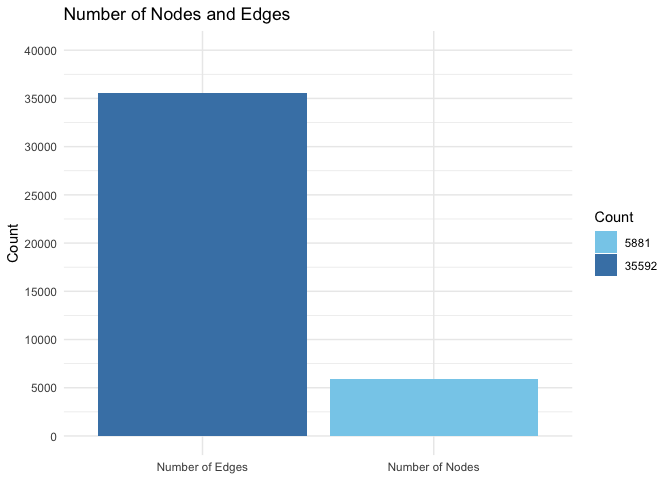<!-- -->

The objective of this analysis is to explore and investigate the observed pattern in order to gain a deeper understanding of its implications and underlying dynamics.
This network reveals a notable pattern: users with a positive rating exhibit greater centrality within the graph, while users with negative ratings tend to occupy peripheral positions.


```r
# Set graphical parameters for the plot
par(mar = c(5, 4, 1, 2) + 0.1, pin = c(4, 4))  # Increase the plot margins and size

E(g)$weight <- df$rating
min_weight <- min(E(g)$weight)
max_weight <- max(E(g)$weight)
# Update the plot function with enlarged graph
plot(g, edge.arrow.size = 0.2, vertex.label = NA, vertex.size = 2,
     edge.width = abs(E(g)$weight - min_weight + 1) / (max_weight - min_weight + 1),
     edge.color = ifelse(E(g)$weight > 0, "green", "red"),
     layout = layout.auto)

# Add a legend for edge color
legend("topleft", legend = c("Positive", "Negative"), col = c("green", "red"),
       pch = 20, cex = 0.8, bty = "n", title = "Edge Weight")

# Add a main title to the plot
title(main = "Bitcoin OTC Network")
```

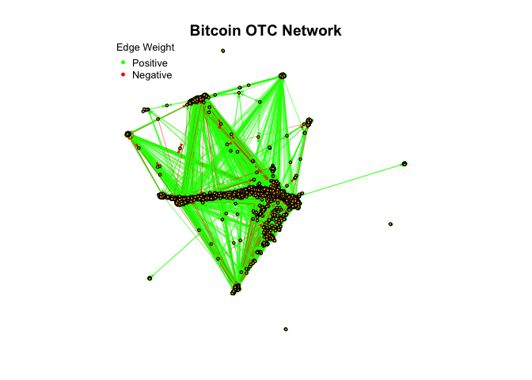<!-- -->


#### 2.1 In-Degree and Out-Degree Centrality

In a directed network, the in-degree centrality and out-degree centrality measures capture different aspects of node connectivity and interactions:

\* **In-Degree Centrality**: In-Degree centrality measures the number of incoming edges that a node receives from others in the network.

\* **Out-Degree Centrality**: Out-Degree centrality measures the number of outgoing edges or connections that a node initiates towards other nodes in the network.


```r
# Calculate in-degree and out-degree distributions
dd_in <- in_degree_dist(g)
dd_out <- out_degree_dist(g)

# Set graphical parameters for the plot
par(mfrow = c(1, 2), mar = c(5, 4, 1, 2) + 0.1)

# Plot in-degree distribution
plot(log(dd_in$d_in), log(dd_in$fd_in), main = "In-Degree Distribution",
     xlab = "In-Degree", ylab = "Frequency")
text(log(dd_in$d_in), log(dd_in$fd_in), labels = names(dd_in$fd_in), pos = 3)

# Plot out-degree distribution
plot(log(dd_out$d_out), log(dd_out$fd_out), main = "Out-Degree Distribution",
     xlab = "Out-Degree", ylab = "Frequency")
text(log(dd_out$d_out), log(dd_out$fd_out), labels = names(dd_out$fd_out), pos = 3)
```

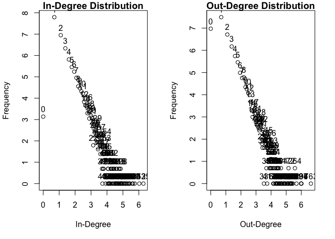<!-- -->

In the case of the in-degree distribution, it is evident that nodes with a lower in-degree are more prevalent, while nodes with a higher in-degree are less common. Notably, an exception to this trend is observed for nodes with an in-degree of 0, which have a relatively low frequency.

Regarding the out-degree distribution, a distinct pattern emerges. Nodes with a lower out-degree, including those with an out-degree of 0, exhibit the highest frequency. In contrast, nodes with a higher out-degree are less frequently encountered.


#### 2.2 Estimating Power Laws of Degree Centrality
A regression analysis is performed on the degree distribution data, in-degree and out-degree respectively.


```r
# Convert dd_in list to data frame
dd_in_df <- as.data.frame(dd_in)

# Fit linear regression model
m0 <- lm(log(fd_in.Freq) ~ log(d_in), data = dd_in_df)
# Fit Poisson regression model
m1 <- glm(fd_in.Freq ~ log(d_in), family = poisson, data = dd_in_df)

# Create scatter plot for in-degree distribution
p1 <- ggplot(dd_in_df, aes(x = log(d_in), y = log(fd_in.Freq))) +
  geom_point() +
  labs(x = "In-Degree", y = "Frequency") +
  ggtitle("In-Degree Distribution") +
  theme_minimal() +
  theme(plot.title = element_text(hjust = 0.5)) +
  geom_abline(aes(intercept = m0$coef[1], slope = m0$coef[2], color = "Linear"), show.legend = TRUE) +
  geom_abline(aes(intercept = m1$coef[1], slope = m1$coef[2], color = "Poisson"), show.legend = TRUE) +
  scale_color_manual(values = c("red", "blue"), labels = c("Linear", "Poisson")) +
  guides(color = guide_legend(title = "Model"))

# Convert dd_out list to data frame
dd_out_df <- as.data.frame(dd_out)

# Fit linear regression model
m0 <- lm(log(fd_out.Freq) ~ log(d_out), data = dd_out_df)
# Fit Poisson regression model
m1 <- glm(fd_out.Freq ~ log(d_out), family = poisson, data = dd_out_df)

# Create scatter plot for out-degree distribution
p2 <- ggplot(dd_out_df, aes(x = log(d_out), y = log(fd_out.Freq))) +
  geom_point() +
  labs(x = "Out-Degree", y = "Frequency") +
  ggtitle("Out-Degree Distribution") +
  theme_minimal() +
  theme(plot.title = element_text(hjust = 0.5)) +
  geom_abline(aes(intercept = m0$coef[1], slope = m0$coef[2], color = "Linear"), show.legend = TRUE) +
  geom_abline(aes(intercept = m1$coef[1], slope = m1$coef[2], color = "Poisson"), show.legend = TRUE) +
  scale_color_manual(values = c("red", "blue"), labels = c("Linear", "Poisson")) +
  guides(color = guide_legend(title = "Model"))

# Arrange plots in one window
grid.arrange(p1, p2, nrow = 1)
```

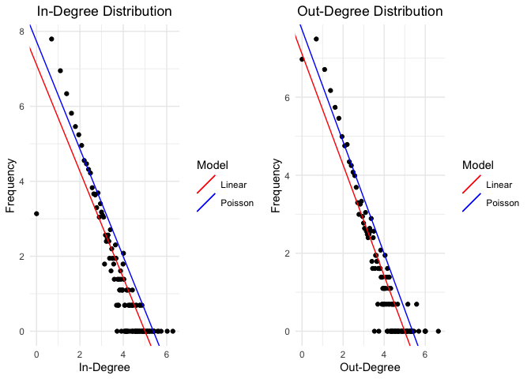<!-- -->


It emerges that in both cases the Poisson regression model seems to follow better the data and to capture better the relationship between the degree and frequency of the degree distribution.

#### 2.3  Weigths and Strength

The weights in this network are represented by the rating assigned from the users which vary in the interval between "-10 and 10". The mean value of the weigths is $1.012$.


```r
# Assign weights to graph edges
E(g)$weight <- data[, 3]

# Calculate min, max, and mean weights
min_weight <- min(E(g)$weight)
max_weight <- max(E(g)$weight)
mean_weight <- mean(E(g)$weight)

# Print the results on the same line with labels
cat("Minimum Weight:", min_weight, " | Maximum Weight:", max_weight, " | Mean Weight:", mean_weight, "\n")
```

```
## Minimum Weight: -10  | Maximum Weight: 10  | Mean Weight: 1.012025
```


```r
# Create the histogram using ggplot
ggplot(data = as.data.frame(E(g)$weight)) +
  geom_histogram(aes(x = E(g)$weight), binwidth = 1, fill = "skyblue", color = "black") +
  labs(x = "Weight", y = "Frequency", title = "Weight Distribution") +
  theme_minimal()
```

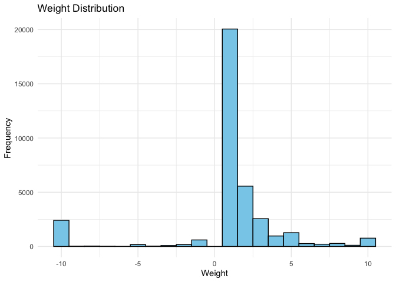<!-- -->

It is shown that the percentage of positive edges is 89%.


```r
num_positive_edges <- sum(E(g)$weight > 0)
num_negative_edges <- sum(E(g)$weight < 0)
num_edges <- sum(num_positive_edges, num_negative_edges)
percentage_positive_edges <- num_positive_edges / num_edges * 100

cat("Number of Positive Edges:", num_positive_edges, " | Number of Negative Edges:", num_negative_edges, " | Percentage of Positive Edges:", round(percentage_positive_edges, 2), "\n")
```

```
## Number of Positive Edges: 32029  | Number of Negative Edges: 3563  | Percentage of Positive Edges: 89.99
```

Now the weights are rescaled from [-10,10] to [1,20] in order to have positive weights for the analysis that follows.

```r
new_min <- 1
new_max <- 20

rescale_weight <- function(w){
  rescaled_w <- ((w - min_weight) / (max_weight - min_weight)) * (new_max - new_min) + new_min
  return(rescaled_w)
}

original_weights <- E(g)$weight

rescaled_weights <- rescale_weight(original_weights)

E(g)$weight <- rescaled_weights
```


```r
sort(unique(E(g)$weight))
```

```
##  [1]  1.00  1.95  2.90  3.85  4.80  5.75  6.70  7.65  8.60  9.55 11.45 12.40
## [13] 13.35 14.30 15.25 16.20 17.15 18.10 19.05 20.00
```


An interesting network summary statistic is given by the strength of the network, in particular it make sense to set the "mode" parameter of the function = "in", in order to capture the strength of the nodes in terms of the incoming edges. This will provide a measure of the reputation of each user.


```r
trust_strength <- strength(g, mode = "in", weights = E(g)$weight)
plot(trust_strength,
     main = "Trust Strength for Each Node", xlab = "Node", ylab = "Trust Strenght")
```

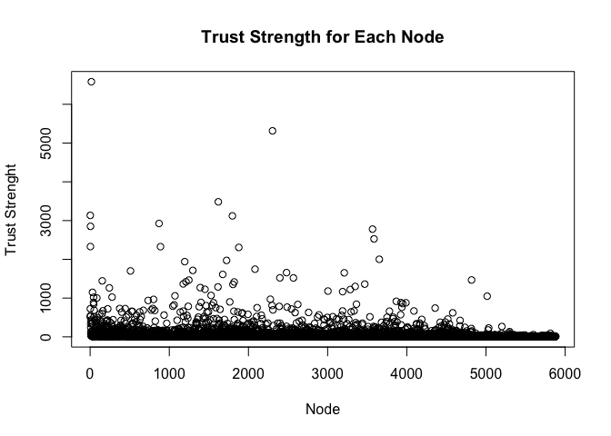<!-- -->


The higher is the trust strength, the higher is the in-degree centrality. This means that users which are less trusted, hence worst rated, have fewer nodes interacting with them.

Also considering the Out-Degree Centrality we can see the same pattern. Nodes with an higher trust strength have more outgoing edges, nodes with less trust strength have less outgoing edges. 

A possible interpretation is that the nodes with bad ratings are less trusted and as a consequence have less interactions.


```r
in_degree <- degree(g, mode = "in")
out_degree <- degree(g, mode = "out")

# Create a data frame with trust_strength, in_degree, and out_degree
trust_data <- data.frame(Trust_Strength = trust_strength,
                         In_Degree = in_degree,
                         Out_Degree = out_degree)

# Create the scatter plots using ggplot
plot_in_degree <- ggplot(trust_data, aes(x = Trust_Strength, y = In_Degree)) +
  geom_point(color = "blue") +
  labs(title = "Trust Strength vs In-Degree Centrality",
       x = "Trust Strength", y = "In-Degree Centrality") +
  theme_minimal() +
  theme(plot.title = element_text(hjust = 0.5, margin = margin(b = 20)))

plot_out_degree <- ggplot(trust_data, aes(x = Trust_Strength, y = Out_Degree)) +
  geom_point(color = "red") +
  labs(title = "Trust Strength vs Out-Degree Centrality",
       x = "Trust Strength", y = "Out-Degree Centrality") +
  theme_minimal() +
  theme(plot.title = element_text(hjust = 0.5, margin = margin(b = 20)))

# Arrange the plots in a grid
gridExtra::grid.arrange(plot_in_degree, plot_out_degree, ncol = 2)
```

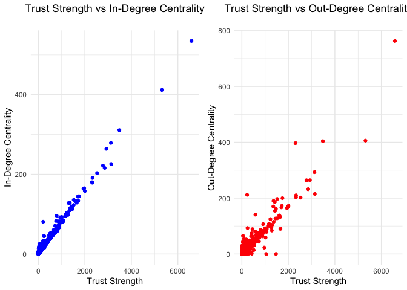<!-- -->

#### 2.4 Important Users

After summarizing the network, let's now identify important actors in it.
Let's compute the **betweenness centrality** for each node in the network, considering the directed nature of the graph and using the weights assigned to the edges.

The betweenness centrality of a node represents the extent to which that node lies on the shortest paths between other pairs of nodes in the network. It quantifies the influence or control a node has over the flow of information or transactions in the network.


```r
b <- betweenness(g, directed = TRUE, weights = E(g)$weight)

# Create a layout with two plots in a single row
par(mfrow = c(1, 2))

# Plot 1: Betweenness Centrality
plot(b, main = "Betweenness Centrality", xlab = "Node", ylab = "Betweenness")

# Plot 2: Sorted Betweenness values
plot(sort(b), main = "Sorted Betweenness Centrality", xlab = "Index", ylab = "Betweenness")
```

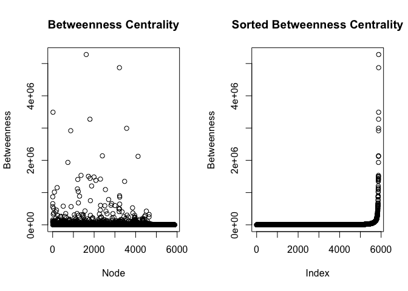<!-- -->

Let's plot the ego network of the most important vertex.

```r
ia <- order(b, decreasing = TRUE)[1]
V(g)$name[ia]
```

```
## [1] "1810"
```

```r
g1 <- subgraph.edges(g, E(g)[.inc(ia)])
plot(g1, vertex.label= NA)
```

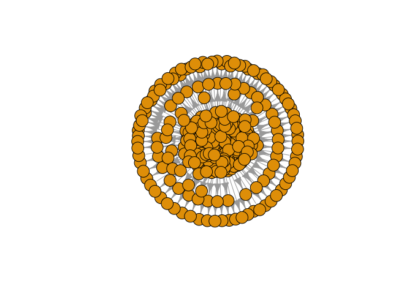<!-- -->

It is shown that this node other than being the most important user in the network has also a very high trust strength as well as in-degree and out-degree centrality.


```r
node_id <- "1810"

trust_strength_value <- trust_strength[node_id]
in_degree_value <- in_degree[node_id]
out_degree_value <- out_degree[node_id]

cat("Node Id:",node_id,"| Trust Strength",":", trust_strength_value, " | In-Degree Centrality for Node", ":", in_degree_value, " | Out-Degree Centrality:", out_degree_value)
```

```
## Node Id: 1810 | Trust Strength : 3484  | In-Degree Centrality for Node : 311  | Out-Degree Centrality: 404
```


Comparing the **Trust Strength** of each node vs the **Betweenness**, the general trend is that nodes with an high trust strength have an high betweenness. Although it emerges that a node in particular have an high betweenness even though it has a low trust strength.


```r
trust_betweenness <- data.frame(Trust_Strength = trust_strength, Betweenness = b, Node_Name = V(g)$name)

ggplot(trust_betweenness, aes(x = Trust_Strength, y = Betweenness)) +
  geom_jitter() +
  labs(title = "Trust Strength vs Betweenness Centrality",
       x = "Trust Strength",
       y = "Betweenness") +
  geom_text(aes(label = Node_Name), hjust = 0, vjust = 0, nudge_x = 0.1, nudge_y = 0.1) +
  theme_minimal() +
  theme(plot.title = element_text(hjust = 0.5, margin = margin(b = 20)))
```

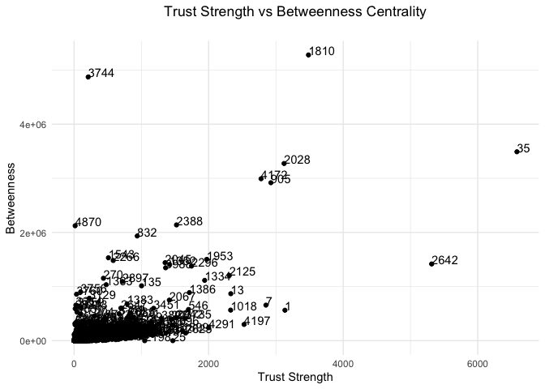<!-- -->

By looking more closely to this node it can be seen that it has a very high betweenness, a relatively low trust strength as well as in-degree and out-degree centrality. Therefore it might be that this user is connecting different parts of the network through indirect paths and it's reputation is quite low.


```r
node_id2 <- "3744"

cat("Node Id:",node_id2,"| Trust Strength",":", trust_strength[node_id2], " | In-Degree Centrality for Node", ":", in_degree[node_id2], " | Out-Degree Centrality:", out_degree[node_id2])
```

```
## Node Id: 3744 | Trust Strength : 209.25  | In-Degree Centrality for Node : 81  | Out-Degree Centrality: 32
```


```r
g1 <- subgraph.edges(g, E(g)[.inc(node_id2)])
plot(g1, vertex.label= NA)
```

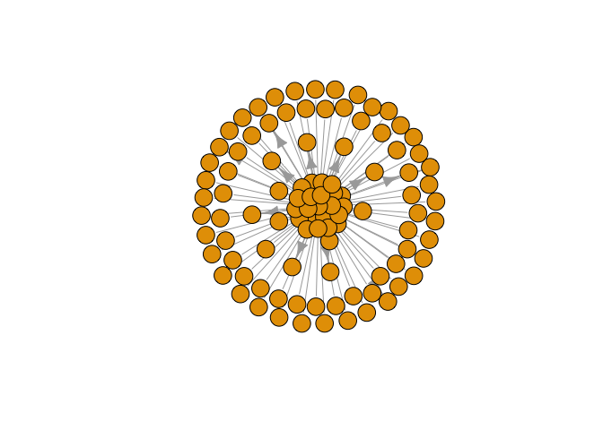<!-- -->


### 3. Network Sampling


We decided to apply **the induced subgraph sampling** (for the sake of simplicity we consider an undirected Graph), calculates the degree distributions of the original and subgraph, fits **GLMs** to both distributions, and creates a plot with the degree and frequency on logarithmic scales, along with lines representing the fitted models.


```r
n_values <- c(500, 1000, 1500,2000)

plots <- lapply(n_values, function(n) {
  gs <- induced_subgraph(g, sample(V(g), n))

  dd0 <- degree_dist(g)
  dd0 <- as.data.frame(dd0)  # Convert to data frame
  m0 <- glm(fd.Freq ~ log(d), family = poisson, data = dd0)

  dd1 <- degree_dist(gs)
  dd1 <- as.data.frame(dd1)  # Convert to data frame
  m1 <- glm(fd.Freq ~ log(d), family = poisson, data = dd1)

  # Combine the data frames
  combined_data <- rbind(
    transform(dd0, graph = "Original Graph"),
    transform(dd1, graph = "Subgraph")
  )

  # Extract coefficients
  coefficients <- data.frame(
    graph = c("Original Graph", "Subgraph"),
    intercept = c(coef(m0)[1], coef(m1)[1]),
    slope = c(coef(m0)[2], coef(m1)[2])
  )

  # Plot with lines and points
  p <- ggplot(combined_data, aes(x = log(d), y = log(fd.Freq), color = graph)) +
    geom_point(shape = 19) +
    geom_abline(aes(intercept = intercept, slope = slope, linetype = graph), data = coefficients) +
    labs(x = "log(d)", y = "log(fd)", color = "Graph") +
    ggtitle(paste(" Degree Distribution n =", n, ""))+
    theme(plot.title = element_text(size = 9))
  
  # Return the plot
  return(p)
})

# Combine the plots in a 2x2 matrix
# Display the combined plot
plot_combined <- grid.arrange(grobs = plots, ncol = 2)
```

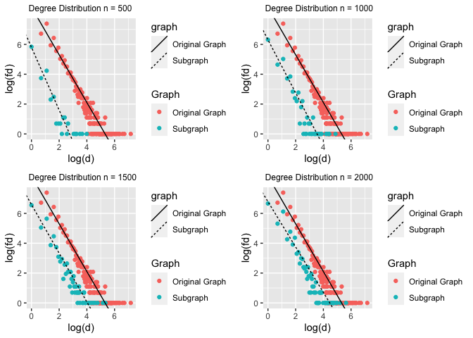<!-- -->


We spot that the line of subgraph is **lower** than the line of original graph this is due to the count of degree, because it is reasonably that the subgraph has lower nodes than the original subgraph , but as we can expected when we increase `n`  tend to be almost the same .

Furthermore, they are almost **parallel** so this meansthat we have a good estimates but we want to see the **variability** in the **sampling process**.


```r
n_values <- c(500, 1000, 1500, 2000)

plots <- lapply(n_values, function(n) {
  s <- replicate(ns, {
    dd <- degree_dist(induced_subgraph(g, sample(V(g), n)))
    -glm(fd ~ log(d), family = poisson, data = dd)$coef[2]
  })

  alpha_hat <- -m0$coef[2]

  # Create a data frame for the histogram
  hist_data <- data.frame(s = s)

  # Plot the histogram with a vertical line
  p <- ggplot(hist_data, aes(x = s)) +
    geom_histogram(bins = 30, fill = "lightblue", color = "black", alpha = 0.5) +
    geom_vline(xintercept = alpha_hat, color = "red", linetype = "dashed", size = 1.2) +
    labs(x = "Coefficient Value (s)", y = "Frequency") +
    ggtitle(paste("Histogram of Coefficient Values (n =", n, ")")) +
    theme_minimal() +
    theme(plot.title = element_text(size = 10))  # Adjust the size of the title text
  
  # Return the plot
  return(p)
})

# Combine the plots in a 2x2 matrix
# Display the combined plot
plot_combined <- grid.arrange(grobs = plots, ncol = 2)
```

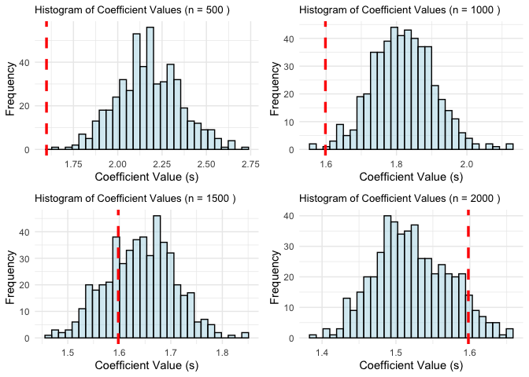<!-- -->


We can see that firstly it **overstimate** the values of coefficient in the subgraph , and then 
when we increase `n` tend to be almost the exactly the same and in last picture tend to **understimate** a little bit the values.


### 4. Community Detection

When it comes to community detection in directed graphs, the Walktrap algorithm becomes a valuable tool. While other popular methods like the **Fast Greedy algorithm** are effective for community detection in undirected graphs, they may encounter limitations when applied to directed graphs in certain scenarios.

The **Walktrap algorithm** offers an alternative approach that overcomes this limitation, allowing us to discover communities within directed graphs. By leveraging random walks on the graph, the Walktrap algorithm identifies densely connected regions that represent distinct communities.

One crucial aspect of community detection is measuring the quality of identified communities. 
**Modularity** is a widely adopted metric for evaluating the strength of community structures. 
Modularity assesses the difference between the observed edge density within communities and the expected edge density in a random network.

We see that when we increase `n` , the modularity decrease. This is because as the **subgraph** becomes more connected, it may become more difficult to identify distinct communities.
However, it's important to note that the relationship between modularity and graph size can vary depending on the specific characteristics of the graph, the community detection algorithm used, and the underlying community structure. So, while a decrease in modularity with increasing `n` is common, it may not hold true for all cases.


```r
# Set graphical parameters for the plot
par(mfrow = c(1, 2), mar = c(5, 4, 1, 2) + 0.1)

# Loop through different values of n
for (n in c(500, 1000)) {
  # Generate the subgraph
  gs <- induced_subgraph(g, sample(V(g), n))
  
  # Perform community detection
  community <- walktrap.community(gs)
  
  # Compute modularity
  mod <- modularity(community)
  
  # Create the plot with Fruchterman-Reingold layout
  plot_title <- paste("n =", n, "   Modularity =", round(mod, 2))
  plot(community, gs, vertex.label = NA, vertex.size = 5, layout = layout_with_fr, main = plot_title)
}
```

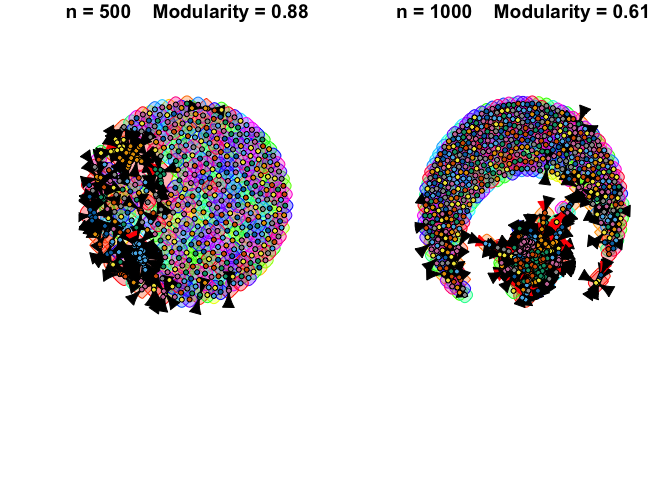<!-- -->


The visual analysis of the two graphs, particularly when `n` = 1000, reveals the detection of two distinct communities as anticipated. It can be inferred that one community, positioned more centrally, corresponds to the nodes with positive ratings, while the other community, located at the boundary, represents the nodes with more negative ratings.
Furthermore, we can see, as we expected, that when we increase `n`, the modularity decrease.


